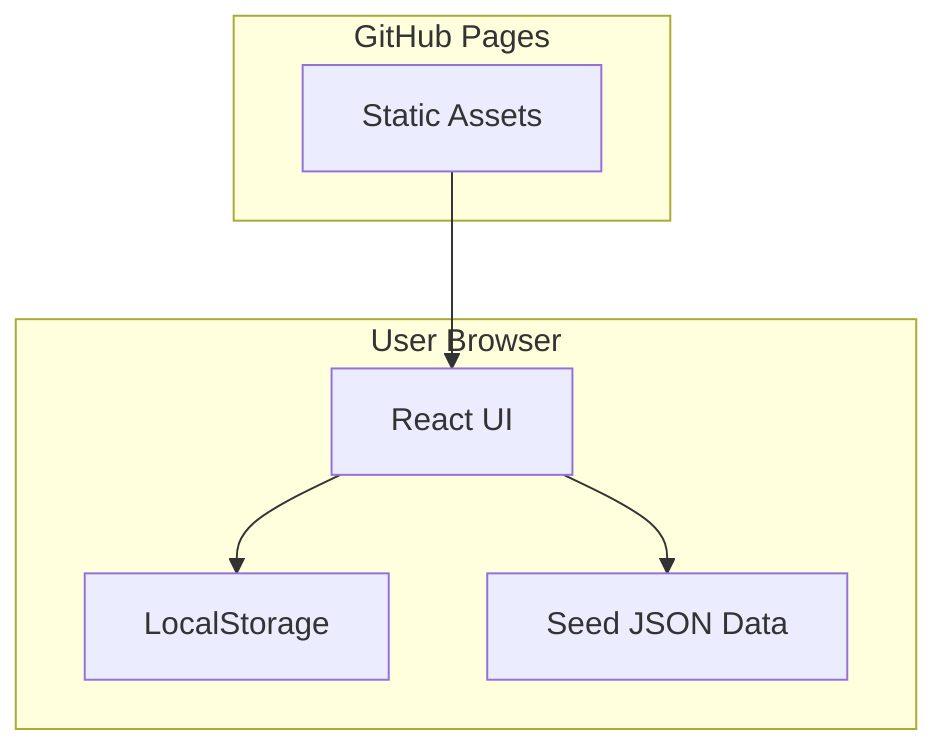
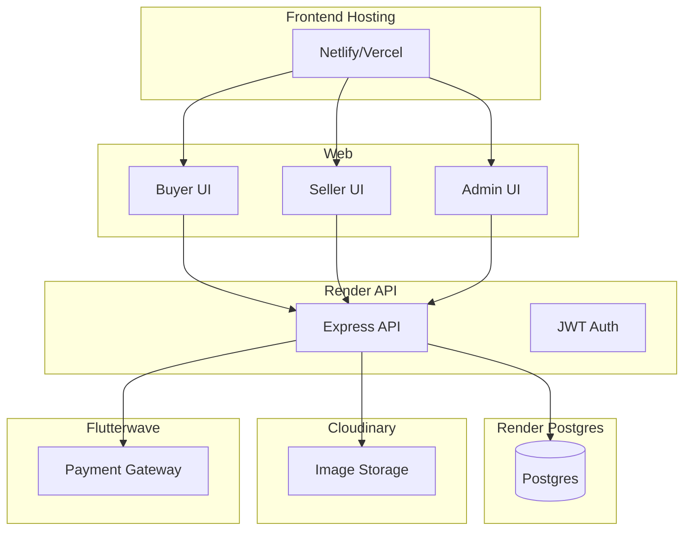

# Autoparts Hub Ghana - System Architecture

## Current (GitHub Pages MVP)
- Static Vite + React site
- Local JSON data for cars and seed listings
- Seller uploads stored in browser localStorage
- No backend yet

## Production (Option 1)
- Render for API + Postgres
- Cloudinary for images
- Flutterwave for payments
- Netlify/Vercel for frontend

